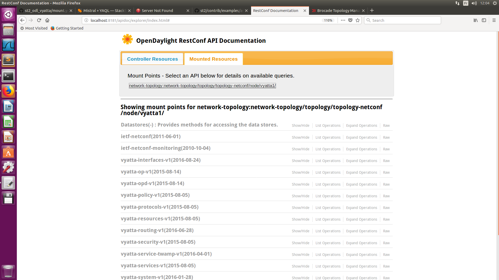

# Stackstorm pack for ODL

- The ODL Controller used in this repo is the commercial distribution from Brocade: Brocade SDN Controller (BSC) version 4.2 (today [Lumina Networks](https://www.luminanetworks.com/)).
- Content of this repo:
	- [Basic checks]()
		- [Display the YANG modules defined in the controller]()
		- [Access the "API Doc Explorer"]()
	- [Mount / Unmount a device to the controller]()
		- [Example 1: Vyatta vRouter]()
		- [Example 2: SLX switch]()
  - [Show interfaces]()
    - [Example 1: Vyatta vRouter]()
    - [Example 2: SLX switch]()
  - [Show ip route]()
    - [Example 1: Vyatta vRouter]()
    - [Example 2: SLX switch]()
  - [Configure BGP]()
    - [Example 1: Vyatta vRouter]()
    - [Example 2: SLX switch]()

## Basic checks:

### Display the YANG modules defined in the controller:

```
mab@mab-infra:~$ st2 run core.http username=admin password=admin url=http://localhost:8181/restconf/modules
.
id: 5a0f0aaa7cae22075eb5e18a
status: succeeded
parameters: 
  password: admin
  url: http://localhost:8181/restconf/modules
  username: admin
result: 
  body: '{"modules":{"module":[{"name":"neutron-lbaasv2","revision":"2015-07-12","namespace":"urn:opendaylight:neutron-lbaasv2"},{"name":"ovsdb","revision":"2015-01-05","namespace":"urn:opendaylight:params:xml:ns:yang:ovsdb"},{"name":"odl-pcep-sync-optimizations","revision":"2015-07-14","namespace":"urn:opendaylight:params:xml:ns:yang:controller:pcep:sync:optimizations"},{"name":"bgp-segment-routing","revision":"2015-10-14","namespace":"urn:opendaylight:params:xml:ns:yang:bgp-segment-routing-ext"},{"name":"odl-pcep-tunnel-provider-cfg","revision":"2013-11-15","namespace":"urn:opendaylight:params:xml:ns:yang:controller:pcep:tunnel:provider"},{"name":"pcep-segment-routing-app-config","revision":"2016-07-07","namespace":"urn:opendaylight:params:xml:ns:yang:controller:pcep:segment-routing-app-config"},{"name":"neutron","revision":"2015-07-12","namespace":"urn:opendaylight:neutron"},{"name":"nc-notifications","revision":"2008-07-14","namespace":"urn:ietf:params:xml:ns:netmod:notification"},{"name":"odl-bgp-rib-spi-cfg","revision":"2013-11-15","namespace":"urn:opendaylight:params:xml:ns:yang:controller:bgp:rib:spi"},{"name":"flow-errors","revision":"2013-11-16","namespace":"urn:opendaylight:flow:errors"},{"name":"pcep-types","revision":"2013-10-05","namespace":"urn:opendaylight:params:xml:ns:yang:pcep:types"},{"name":"bgp-types","revision":"2013-09-19","namespace":"urn:opendaylight:params:xml:ns:yang:bgp-types"},{"name":"odl-bgp-topology-provider-cfg","revision":"2013-11-15","namespace":"urn:opendaylight:params:xml:ns:yang:controller:bgp:topology:provider"},{"name":"sal-table","revision":"2013-10-26","namespace":"urn:opendaylight:table:service"},{"name":"ietf-netconf-monitoring","revision":"2010-10-04","namespace":"urn:ietf:params:xml:ns:yang:ietf-netconf-monitoring"},{"name":"opendaylight-action-types","revision":"2013-11-12","namespace":"urn:opendaylight:action:types"},{"name":"credential-store","revision":"2015-02-26","namespace":"urn:opendaylight:params:xml:ns:yang:aaa:credential-store"},{"name":"shutdown-impl","revision":"2013-12-18","namespace":"urn:opendaylight:params:xml:ns:yang:controller:shutdown:impl"},{"name":"ietf-interfaces","revision":"2014-05-08","feature":["if-mib","pre-provisioning","arbitrary-names"],"namespace":"urn:ietf:params:xml:ns:yang:ietf-interfaces"},{"name":"bgp-peer","revision":"2016-06-06","namespace":"urn:opendaylight:params:xml:ns:yang:controller:bgp:peer:config"},{"name":"node-error","revision":"2014-04-10","namespace":"urn:opendaylight:node:error:service"},{"name":"neutron-binding","revision":"2015-07-12","namespace":"urn:opendaylight:neutron-binding"},{"name":"netconf-northbound","revision":"2015-01-14","namespace":"urn:opendaylight:params:xml:ns:yang:controller:config:netconf:northbound"},{"name":"ted","revision":"2013-07-12","namespace":"urn:TBD:params:xml:ns:yang:network:ted"},{"name":"ietf-access-control-list","revision":"2016-02-18","namespace":"urn:ietf:params:xml:ns:yang:ietf-access-control-list"},{"name":"l3-unicast-igp-topology","revision":"2013-10-21","namespace":"urn:TBD:params:xml:ns:yang:nt:l3-unicast-igp-topology"},{"name":"programming","revision":"2015-07-20","namespace":"urn:opendaylight:params:xml:ns:yang:programming"},{"name":"opendaylight-flow-table-statistics","revision":"2013-12-15","namespace":"urn:opendaylight:flow:table:statistics"},{"name":"netconf-northbound-impl","revision":"2015-01-12","namespace":"urn:opendaylight:params:xml:ns:yang:controller:config:netconf:northbound:impl"},{"name":"odl-pcep-ietf-stateful07","revision":"2013-12-22","namespace":"urn:opendaylight:params:xml:ns:yang:pcep:ietf:stateful"},{"name":"netvirt-providers-config","revision":"2016-01-09","namespace":"urn:opendaylight:params:xml:ns:yang:netvirt:providers:config"},{"name":"bgp-linkstate-app-config","revision":"2016-06-14","namespace":"urn:opendaylight:params:xml:ns:yang:controller:bgp:linkstate-app-config"},{"name":"aaa-authn-netconf-plugin","revision":"2015-07-15","namespace":"config:aaa:authn:netconf:plugin"},{"name":"nicira-extension-impl","revision":"2014-07-11","namespace":"urn:opendaylight:params:xml:ns:yang:openflowplugin:nx:config:impl"},{"name":"bgp-inet","revision":"2015-03-05","namespace":"urn:opendaylight:params:xml:ns:yang:bgp-inet"},{"name":"openflow-switch-connection-provider","revision":"2014-03-28","namespace":"urn:opendaylight:params:xml:ns:yang:openflow:switch:connection:provider"},{"name":"ipv4-packet","revision":"2014-05-28","namespace":"urn:opendaylight:packet:ipv4"},{"name":"clustered-netconf-topology","revision":"2015-11-04","namespace":"urn:opendaylight:params:xml:ns:yang:controller:clustered:netconf:topology"},{"name":"netconf-northbound-notification-impl","revision":"2015-08-07","namespace":"urn:opendaylight:params:xml:ns:yang:controller:netconf:northbound:notification:impl"},{"name":"odl-netconfig-client-cfg","revision":"2014-04-08","namespace":"urn:opendaylight:params:xml:ns:yang:controller:config:netconf:client:dispatcher"},{"name":"iana-afn-safi","revision":"2013-07-04","namespace":"urn:ietf:params:xml:ns:yang:iana-afn-safi"},{"name":"odl-bgp-rib-cfg","revision":"2013-07-01","namespace":"urn:opendaylight:params:xml:ns:yang:controller:bgp:rib:cfg"},{"name":"cluster-singleton-service-spi","revision":"2016-07-18","namespace":"urn:opendaylight:params:xml:ns:yang:md:sal:config:spi:cluster-singleton-service"},{"name":"statistics-manager-control","revision":"2015-08-12","namespace":"urn:opendaylight:params:xml:ns:yang:openflowplugin:sm:control"},{"name":"odl-openconfig-bgp-cfg","revision":"2015-07-18","namespace":"urn:opendaylight:params:xml:ns:yang:controller:bgp:openconfig"},{"name":"opendaylight-group-types","revision":"2013-10-18","namespace":"urn:opendaylight:group:types"},{"name":"odl-bgp-treachability-ipv4-cfg","revision":"2013-11-15","namespace":"urn:opendaylight:params:xml:ns:yang:controller:bgp:reachability:ipv4"},{"name":"data-export-import-akka-info-provider-cfg","revision":"2016-08-16","namespace":"urn:brocade.com:bsc:yang:daexim:akka-info-provider"},{"name":"node-config","revision":"2014-10-15","namespace":"urn:opendaylight:module:config"},{"name":"batch-common","revision":"2016-03-22","namespace":"urn:opendaylight:service:batch:common"},{"name":"sal-flows-batch","revision":"2016-03-14","namespace":"urn:opendaylight:flows:service"},{"name":"netconf-northbound-notification","revision":"2015-08-06","namespace":"urn:opendaylight:params:xml:ns:yang:controller:netconf:northbound:notification"},{"name":"openconfig-bgp-types","revision":"2015-10-09","namespace":"http://openconfig.net/yang/bgp-types"},{"name":"opendaylight-port-statistics","revision":"2013-12-14","namespace":"urn:opendaylight:port:statistics"},{"name":"iana-if-type","revision":"2014-05-08","namespace":"urn:ietf:params:xml:ns:yang:iana-if-type"},{"name":"opendaylight-md-sal-binding-v1-codec","revision":"2016-07-14","namespace":"urn:opendaylight:params:xml:ns:yang:controller:md:sal:binding:v1:codec"},{"name":"nicira-action","revision":"2014-04-21","namespace":"urn:opendaylight:openflowjava:nx:action"},{"name":"netty","revision":"2013-11-19","namespace":"urn:opendaylight:params:xml:ns:yang:controller:netty"},{"name":"actor-system-provider-service","revision":"2015-10-05","namespace":"urn:opendaylight:params:xml:ns:yang:controller:config:actor-system-provider:service"},{"name":"barrier-common","revision":"2016-03-15","namespace":"urn:opendaylight:service:barrier:common"},{"name":"netty-event-executor","revision":"2013-11-12","namespace":"urn:opendaylight:params:xml:ns:yang:controller:netty:eventexecutor"},{"name":"threadpool-impl-flexible","revision":"2013-12-01","namespace":"urn:opendaylight:params:xml:ns:yang:controller:threadpool:impl:flexible"},{"name":"flow-node-inventory","revision":"2013-08-19","namespace":"urn:opendaylight:flow:inventory"},{"name":"data-export-import","revision":"2016-09-21","namespace":"urn:brocade.com:bsc:yang:daexim"},{"name":"sal-flat-batch","revision":"2016-03-21","namespace":"urn:opendaylight:flat-batch:service"},{"name":"opendaylight-legacy-entity-ownership-service-provider","revision":"2016-02-26","namespace":"urn:opendaylight:params:xml:ns:yang:controller:config:legacy-entity-ownership-service-provider"},{"name":"odl-bgp-topology-types","revision":"2016-05-24","namespace":"urn:opendaylight:params:xml:ns:yang:odl-bgp-topology-types"},{"name":"sal-port","revision":"2013-11-07","namespace":"urn:opendaylight:port:service"},{"name":"base-packet","revision":"2014-05-28","namespace":"urn:opendaylight:packet:basepacket"},{"name":"opendaylight-queue-types","revision":"2013-09-25","namespace":"urn:opendaylight:flow:types:queue"},{"name":"openflow-protocol","revision":"2013-07-31","namespace":"urn:opendaylight:openflow:protocol"},{"name":"openflow-augments","revision":"2015-02-25","namespace":"urn:opendaylight:openflow:augments"},{"name":"address-tracker-config","revision":"2016-06-21","namespace":"urn:opendaylight:packet:address-tracker-config"},{"name":"opendaylight-meter-types","revision":"2013-09-18","namespace":"urn:opendaylight:meter:types"},{"name":"opendaylight-md-sal-common","revision":"2013-10-28","namespace":"urn:opendaylight:params:xml:ns:yang:controller:md:sal:common"},{"name":"openconfig-local-routing","revision":"2015-10-09","namespace":"http://openconfig.net/yang/local-routing"},{"name":"shutdown","revision":"2013-12-18","namespace":"urn:opendaylight:params:xml:ns:yang:controller:shutdown"},{"name":"openflow-approved-extensions","revision":"2016-08-02","namespace":"urn:opendaylight:openflow:approved:extensions"},{"name":"bgp-stats-rib-impl","revision":"2016-06-06","namespace":"urn:opendaylight:params:xml:ns:yang:controller:bgp:stats:rib:impl"},{"name":"odl-pcep-auto-bandwidth","revision":"2016-01-09","namespace":"urn:opendaylight:params:xml:ns:yang:controller:pcep:auto:bandwidth"},{"name":"network-concepts","revision":"2013-11-25","namespace":"urn:opendaylight:params:xml:ns:yang:network:concepts"},{"name":"ospf-topology","revision":"2013-07-12","namespace":"urn:ietf:params:xml:ns:yang:ospf-topology"},{"name":"opendaylight-l2-types","revision":"2013-08-27","namespace":"urn:opendaylight:l2:types"},{"name":"opendaylight-meter-statistics","revision":"2013-11-11","namespace":"urn:opendaylight:meter:statistics"},{"name":"bmp-message","revision":"2015-05-12","namespace":"urn:opendaylight:params:xml:ns:yang:bmp-message"},{"name":"pcep-app-config","revision":"2016-07-07","namespace":"urn:opendaylight:params:xml:ns:yang:controller:pcep:app-config"},{"name":"bgp-stats-peer","revision":"2016-06-06","namespace":"urn:opendaylight:params:xml:ns:yang:controller:bgp:stats:peer"},{"name":"odl-pcep-ietf-initiated00","revision":"2013-11-26","namespace":"urn:opendaylight:params:xml:ns:yang:pcep:crabbe:initiated"},{"name":"netconf-topology","revision":"2015-07-27","namespace":"urn:opendaylight:params:xml:ns:yang:controller:netconf:topology"},{"name":"openconfig-network-instance","revision":"2015-10-18","namespace":"http://openconfig.net/yang/network-instance"},{"name":"odl-bgp-treachability-ipv6-cfg","revision":"2013-11-15","namespace":"urn:opendaylight:params:xml:ns:yang:controller:bgp:reachability:ipv6"},{"name":"sal-group","revision":"2013-09-18","namespace":"urn:opendaylight:group:service"},{"name":"opendaylight-port-types","revision":"2013-09-25","namespace":"urn:opendaylight:flow:types:port"},{"name":"neutron-portsecurity","revision":"2015-07-12","namespace":"urn:opendaylight:neutron-portsecurity"},{"name":"rsvp","revision":"2015-08-20","namespace":"urn:opendaylight:params:xml:ns:yang:rsvp"},{"name":"neutron-metering","revision":"2015-07-12","namespace":"urn:opendaylight:neutron-metering"},{"name":"odl-pcep-topology-provider-cfg","revision":"2013-11-15","namespace":"urn:opendaylight:params:xml:ns:yang:controller:pcep:topology:provider"},{"name":"ospf-topology","revision":"2013-10-21","namespace":"urn:TBD:params:xml:ns:yang:ospf-topology"},{"name":"stp-status-aware-node-connector","revision":"2014-07-14","namespace":"urn:opendaylight:l2switch:loopremover"},{"name":"neutron-extensions","revision":"2016-06-17","namespace":"urn:opendaylight:neutron-extensions"},{"name":"packet-processing","revision":"2013-07-09","namespace":"urn:opendaylight:packet:service"},{"name":"ethernet-packet","revision":"2014-05-28","namespace":"urn:opendaylight:packet:ethernet"},{"name":"arp-handler-config","revision":"2014-05-28","namespace":"urn:opendaylight:packet:arp-handler-config"},{"name":"netconf-auth","revision":"2015-07-15","namespace":"urn:opendaylight:params:xml:ns:yang:controller:config:netconf:auth"},{"name":"lldp-speaker-config","revision":"2016-05-12","namespace":"urn:opendaylight:params:xml:ns:yang:openflow:applications:lldp-speaker:config"},{"name":"sal-meters-batch","revision":"2016-03-16","namespace":"urn:opendaylight:meters:service"},{"name":"pcep-ietf-stateful07-app-config","revision":"2016-07-07","namespace":"urn:opendaylight:params:xml:ns:yang:controller:pcep:ietf-stateful07-app-config"},{"name":"sal-remote","revision":"2014-01-14","namespace":"urn:opendaylight:params:xml:ns:yang:controller:md:sal:remote"},{"name":"ietf-packet-fields","revision":"2016-02-18","namespace":"urn:ietf:params:xml:ns:yang:ietf-packet-fields"},{"name":"network-topology-pcep","revision":"2013-10-24","namespace":"urn:opendaylight:params:xml:ns:yang:topology:pcep"},{"name":"opendaylight-sal-binding-broker-impl","revision":"2013-10-28","namespace":"urn:opendaylight:params:xml:ns:yang:controller:md:sal:binding:impl"},{"name":"address-tracker","revision":"2014-06-17","namespace":"urn:opendaylight:address-tracker"},{"name":"threadgroup","revision":"2013-11-07","namespace":"urn:opendaylight:params:xml:ns:yang:controller:netty:threadgroup"},{"name":"neutron-ports","revision":"2015-07-12","namespace":"urn:opendaylight:neutron-ports"},{"name":"odl-bgp-rib-impl-cfg","revision":"2016-03-30","namespace":"urn:opendaylight:params:xml:ns:yang:controller:bgp:rib:impl"},{"name":"bgp-labeled-unicast","revision":"2015-05-25","namespace":"urn:opendaylight:params:xml:ns:yang:bgp-labeled-unicast"},{"name":"opendaylight-md-sal-binding","revision":"2013-10-28","namespace":"urn:opendaylight:params:xml:ns:yang:controller:md:sal:binding"},{"name":"bgp-multiprotocol","revision":"2013-09-19","namespace":"urn:opendaylight:params:xml:ns:yang:bgp-multiprotocol"},{"name":"system-notifications","revision":"2013-09-27","namespace":"urn:opendaylight:openflow:system"},{"name":"bmp-monitor","revision":"2015-05-12","namespace":"urn:opendaylight:params:xml:ns:yang:bmp-monitor"},{"name":"neutron-qos-ext","revision":"2016-06-13","namespace":"urn:opendaylight:neutron-qos-ext"},{"name":"network-topology","revision":"2013-10-21","namespace":"urn:TBD:params:xml:ns:yang:network-topology"},{"name":"protocol-framework","revision":"2014-03-13","namespace":"urn:opendaylight:params:xml:ns:yang:controller:protocol:framework"},{"name":"ietf-netconf-monitoring-extension","revision":"2013-12-10","namespace":"urn:ietf:params:xml:ns:yang:ietf-netconf-monitoring-extension"},{"name":"sal-queue","revision":"2015-03-05","namespace":"urn:opendaylight:queue:service"},{"name":"odl-programming-impl-cfg","revision":"2015-07-20","namespace":"urn:opendaylight:params:xml:ns:yang:controller:programming:impl"},{"name":"yang-ext","revision":"2013-07-09","namespace":"urn:opendaylight:yang:extension:yang-ext"},{"name":"bgp-vpn-ipv4","revision":"2016-02-10","namespace":"urn:opendaylight:params:xml:ns:yang:bgp-vpn-ipv4"},{"name":"sal-role","revision":"2015-07-27","namespace":"urn:opendaylight:role:service"},{"name":"openconfig-extensions","revision":"2015-10-09","namespace":"http://openconfig.net/yang/openconfig-ext"},{"name":"host-tracker-service","revision":"2014-06-24","namespace":"urn:opendaylight:host-tracker"},{"name":"threadpool-impl-fixed","revision":"2013-12-01","namespace":"urn:opendaylight:params:xml:ns:yang:controller:threadpool:impl:fixed"},{"name":"overlay","revision":"2015-01-05","namespace":"urn:opendaylight:params:xml:ns:yang:overlay"},{"name":"neutron-provider","revision":"2015-07-12","namespace":"urn:opendaylight:neutron-provider"},{"name":"opendaylight-direct-statistics","revision":"2016-05-11","namespace":"urn:opendaylight:direct:statistics"},{"name":"openflowjava-nx-config","revision":"2014-07-11","namespace":"urn:opendaylight:params:xml:ns:yang:openflowplugin:ofjava:nx:config"},{"name":"ieee754","revision":"2013-08-19","namespace":"urn:opendaylight:params:xml:ns:yang:ieee754"},{"name":"openflow-switch-connection-provider-impl","revision":"2014-03-28","namespace":"urn:opendaylight:params:xml:ns:yang:openflow:switch:connection:provider:impl"},{"name":"topology-tunnel","revision":"2013-08-19","namespace":"urn:opendaylight:params:xml:ns:yang:topology:tunnel"},{"name":"neutron-networks","revision":"2015-07-12","namespace":"urn:opendaylight:neutron-networks"},{"name":"openconfig-bgp-multiprotocol","revision":"2015-10-09","namespace":"http://openconfig.net/yang/bgp-multiprotocol"},{"name":"bgp-peer-rpc","revision":"2016-03-22","namespace":"urn:opendaylight:params:xml:ns:yang:bgp-peer-rpc"},{"name":"data-export-import-spi","revision":"2016-08-16","namespace":"urn:brocade.com:bsc:yang:daexim:spi"},{"name":"neutron-fwaas","revision":"2015-07-12","namespace":"urn:opendaylight:neutron-fwaas"},{"name":"shared-schema-repository","revision":"2015-07-27","namespace":"urn:opendaylight:params:xml:ns:yang:controller:netconf:topology:shared:schema:repository"},{"name":"odl-bgp-evpn","revision":"2016-03-21","namespace":"urn:opendaylight:params:xml:ns:yang:bgp-evpn"},{"name":"sal-groups-batch","revision":"2016-03-15","namespace":"urn:opendaylight:groups:service"},{"name":"opendaylight-ipv6-arbitrary-bitmask-fields","revision":"2016-02-24","namespace":"urn:opendaylight:opendaylight-ipv6-arbitrary-bitmask-fields"},{"name":"openflow-switch-connection-config","revision":"2016-05-06","namespace":"urn:opendaylight:params:xml:ns:yang:openflow:switch:connection:config"},{"name":"opendaylight-group-statistics","revision":"2013-11-11","namespace":"urn:opendaylight:group:statistics"},{"name":"sal-restconf-service","revision":"2015-07-08","namespace":"urn:opendaylight:params:xml:ns:yang:controller:sal:restconf:service"},{"name":"bgp-flowspec","revision":"2015-08-07","namespace":"urn:opendaylight:params:xml:ns:yang:bgp-flowspec"},{"name":"ietf-netconf","revision":"2011-06-01","feature":["candidate","confirmed-commit","startup","xpath","rollback-on-error","writable-running","validate","url"],"namespace":"urn:ietf:params:xml:ns:netconf:base:1.0"},{"name":"openflow-types","revision":"2013-07-31","namespace":"urn:opendaylight:openflow:common:types"},{"name":"netty-timer","revision":"2013-11-19","namespace":"urn:opendaylight:params:xml:ns:yang:controller:netty:timer"},{"name":"neutron-bgpvpns","revision":"2015-09-03","namespace":"urn:opendaylight:neutron-bgpvpns"},{"name":"odl-pcep-api-cfg","revision":"2013-04-09","namespace":"urn:opendaylight:params:xml:ns:yang:controller:pcep"},{"name":"host-tracker-config","revision":"2014-05-28","namespace":"urn:opendaylight:l2switch:host-tracker-config"},{"name":"remote-rpc-connector","revision":"2014-07-07","namespace":"urn:opendaylight:params:xml:ns:yang:controller:config:remote-rpc-connector"},{"name":"lldp-speaker","revision":"2014-10-23","namespace":"urn:opendaylight:params:xml:ns:yang:openflow:applications:lldp-speaker"},{"name":"data-export-import-cfg","revision":"2016-08-03","namespace":"urn:brocade.com:bsc:yang:daexim-config"},{"name":"opendaylight-statistics-types","revision":"2013-09-25","namespace":"urn:opendaylight:model:statistics:types"},{"name":"openflow-provider-config","revision":"2016-05-10","namespace":"urn:opendaylight:params:xml:ns:yang:openflow:provider:config"},{"name":"ietf-restconf","revision":"2013-10-19","namespace":"urn:ietf:params:xml:ns:yang:ietf-restconf"},{"name":"netconf-node-inventory","revision":"2014-01-08","namespace":"urn:opendaylight:netconf-node-inventory"},{"name":"neutron-sfc-flow-classifier","revision":"2016-05-11","namespace":"urn:opendaylight:neutron-sfc-flow-classifier"},{"name":"neutron-attrs","revision":"2015-07-12","namespace":"urn:opendaylight:neutron-attrs"},{"name":"iana","revision":"2013-08-16","namespace":"urn:opendaylight:params:xml:ns:yang:iana"},{"name":"opendaylight-config-dom-datastore","revision":"2014-06-17","namespace":"urn:opendaylight:params:xml:ns:yang:controller:md:sal:core:spi:config-dom-store"},{"name":"bgp-vpn","revision":"2016-04-13","namespace":"urn:opendaylight:params:xml:ns:yang:bgp-vpn"},{"name":"bgp-message","revision":"2013-09-19","namespace":"urn:opendaylight:params:xml:ns:yang:bgp-message"},{"name":"rpc-context","revision":"2013-06-17","namespace":"urn:ietf:params:xml:ns:yang:rpc-context"},{"name":"opendaylight-sal-dom-broker-impl","revision":"2013-10-28","namespace":"urn:opendaylight:params:xml:ns:yang:controller:md:sal:dom:impl"},{"name":"data-export-import-internal","revision":"2016-09-21","namespace":"urn:brocade.com:bsc:yang:daexim-internal"},{"name":"ietf-inet-types","revision":"2010-09-24","namespace":"urn:ietf:params:xml:ns:yang:ietf-inet-types"},{"name":"openflow-provider","revision":"2015-03-31","namespace":"urn:opendaylight:params:xml:ns:yang:openflow:api"},{"name":"odl-bgp-topology-config","revision":"2016-07-26","namespace":"urn:opendaylight:params:xml:ns:yang:odl-bgp-topology-config"},{"name":"threadpool","revision":"2013-04-09","namespace":"urn:opendaylight:params:xml:ns:yang:controller:threadpool"},{"name":"netconf-northbound-ssh","revision":"2015-01-14","namespace":"urn:opendaylight:params:xml:ns:yang:controller:netconf:northbound:ssh"},{"name":"openflow-provider","revision":"2014-03-26","namespace":"urn:opendaylight:params:xml:ns:yang:openflow:common:config"},{"name":"openflow-configuration","revision":"2014-06-30","namespace":"urn:opendaylight:openflow:config"},{"name":"forwarding-rules-manager-config","revision":"2016-05-11","namespace":"urn:opendaylight:params:xml:ns:yang:openflowplugin:app:forwardingrules-manager:config"},{"name":"sal-flow","revision":"2013-08-19","namespace":"urn:opendaylight:flow:service"},{"name":"topology-tunnel-programming","revision":"2013-09-30","namespace":"urn:opendaylight:params:xml:ns:yang:topology:tunnel:programming"},{"name":"openconfig-interfaces","revision":"2016-04-12","namespace":"http://openconfig.net/yang/interfaces"},{"name":"openflow-extensible-match","revision":"2015-02-25","namespace":"urn:opendaylight:openflow:oxm"},{"name":"topology-tunnel-pcep","revision":"2013-08-20","namespace":"urn:opendaylight:params:xml:ns:yang:topology:tunnel:pcep"},{"name":"opendaylight-operational-dom-datastore","revision":"2014-06-17","namespace":"urn:opendaylight:params:xml:ns:yang:controller:md:sal:core:spi:operational-dom-store"},{"name":"opendaylight-topology-view","revision":"2013-10-30","namespace":"urn:opendaylight:model:topology:view"},{"name":"ietf-network-topology","revision":"2015-06-08","namespace":"urn:ietf:params:xml:ns:yang:ietf-network-topology"},{"name":"instance-identifier-patch-module","revision":"2015-11-21","namespace":"instance:identifier:patch:module"},{"name":"ipv6-packet","revision":"2014-05-28","namespace":"urn:opendaylight:packet:ipv6"},{"name":"actor-system-provider-impl","revision":"2015-10-05","namespace":"urn:opendaylight:params:xml:ns:yang:controller:config:actor-system-provider:impl"},{"name":"odl-sal-netconf-connector-cfg","revision":"2015-08-03","namespace":"urn:opendaylight:params:xml:ns:yang:controller:md:sal:connector:netconf"},{"name":"cluster-admin","revision":"2015-10-13","namespace":"urn:opendaylight:params:xml:ns:yang:controller:md:sal:cluster:admin"},{"name":"sal-meter","revision":"2013-09-18","namespace":"urn:opendaylight:meter:service"},{"name":"rfc2385","revision":"2016-03-24","namespace":"urn:opendaylight:params:xml:ns:yang:controller:rfc2385:cfg"},{"name":"bgp-vpn-ipv6","revision":"2016-03-31","namespace":"urn:opendaylight:params:xml:ns:yang:bgp-vpn-ipv6"},{"name":"distributed-datastore-provider","revision":"2014-06-12","namespace":"urn:opendaylight:params:xml:ns:yang:controller:config:distributed-datastore-provider"},{"name":"opendaylight-inventory","revision":"2013-08-19","namespace":"urn:opendaylight:inventory"},{"name":"opendaylight-md-sal-dom","revision":"2013-10-28","namespace":"urn:opendaylight:params:xml:ns:yang:controller:md:sal:dom"},{"name":"network-topology-pcep-programming","revision":"2013-11-06","namespace":"urn:opendaylight:params:xml:ns:yang:topology:pcep:programming"},{"name":"openconfig-bgp-operational","revision":"2015-10-09","namespace":"http://openconfig.net/yang/bgp-operational"},{"name":"odl-pcep-impl-cfg","revision":"2013-06-27","namespace":"urn:opendaylight:params:xml:ns:yang:controller:pcep:impl"},{"name":"ietf-yang-types","revision":"2013-07-15","namespace":"urn:ietf:params:xml:ns:yang:ietf-yang-types"},{"name":"bgp-rib","revision":"2013-09-25","namespace":"urn:opendaylight:params:xml:ns:yang:bgp-rib"},{"name":"odl-netconf-cfg","revision":"2014-04-08","namespace":"urn:opendaylight:params:xml:ns:yang:controller:config:netconf"},{"name":"neutron-L3-ext","revision":"2015-07-12","namespace":"urn:opendaylight:neutron-L3-ext"},{"name":"openconfig-network-instance-types","revision":"2015-10-18","namespace":"http://openconfig.net/yang/network-instance-types"},{"name":"opendaylight-rest-connector","revision":"2014-07-24","namespace":"urn:opendaylight:params:xml:ns:yang:controller:md:sal:rest:connector"},{"name":"openconfig-routing-policy","revision":"2015-10-09","namespace":"http://openconfig.net/yang/routing-policy"},{"name":"openflowplugin-extension-nicira-match","revision":"2014-07-14","namespace":"urn:opendaylight:openflowplugin:extension:nicira:match"},{"name":"neutron-vpnaas","revision":"2015-07-12","namespace":"urn:opendaylight:neutron-vpnaas"},{"name":"loop-remover-config","revision":"2014-05-28","namespace":"urn:opendaylight:packet:loop-remover-config"},{"name":"arp-packet","revision":"2014-05-28","namespace":"urn:opendaylight:packet:arp"},{"name":"topology-tunnel-pcep-programming","revision":"2013-10-30","namespace":"urn:opendaylight:params:xml:ns:yang:topology:tunnel:pcep:programming"},{"name":"odl-general-entity","revision":"2015-09-30","namespace":"urn:opendaylight:params:xml:ns:yang:mdsal:core:general-entity"},{"name":"flow-capable-transaction","revision":"2015-03-04","namespace":"urn:opendaylight:flow:transaction"},{"name":"ted","revision":"2013-10-21","namespace":"urn:TBD:params:xml:ns:yang:network:ted"},{"name":"opendaylight-inmemory-datastore-provider","revision":"2014-06-17","namespace":"urn:opendaylight:params:xml:ns:yang:controller:inmemory-datastore-provider"},{"name":"icmp-packet","revision":"2014-05-28","namespace":"urn:opendaylight:packet:icmp"},{"name":"isis-topology","revision":"2013-07-12","namespace":"urn:TBD:params:xml:ns:yang:network:isis-topology"},{"name":"neutron-l2gateways","revision":"2015-07-12","namespace":"urn:opendaylight:neutron-l2gateways"},{"name":"bgp-openconfig-extensions","revision":"2016-06-14","namespace":"urn:opendaylight:params:xml:ns:yang:bgp:openconfig-extensions"},{"name":"opendaylight-topology-inventory","revision":"2013-10-30","namespace":"urn:opendaylight:model:topology:inventory"},{"name":"opendaylight-table-types","revision":"2013-10-26","namespace":"urn:opendaylight:table:types"},{"name":"l3-unicast-igp-topology","revision":"2013-07-12","namespace":"urn:TBD:params:xml:ns:yang:nt:l3-unicast-igp-topology"},{"name":"pmsi-tunnel","revision":"2016-08-12","namespace":"urn:opendaylight:params:xml:ns:yang:pmsi-tunnel"},{"name":"neutron-constants","revision":"2015-07-12","namespace":"urn:opendaylight:neutron-constants"},{"name":"ietf-inet-types","revision":"2013-07-15","namespace":"urn:ietf:params:xml:ns:yang:ietf-inet-types"},{"name":"notifications","revision":"2008-07-14","namespace":"urn:ietf:params:xml:ns:netconf:notification:1.0"},{"name":"pcep-session-stats","revision":"2014-10-06","namespace":"urn:opendaylight:params:xml:ns:yang:controller:pcep:stats"},{"name":"openflowplugin-extension-nicira-action","revision":"2014-07-14","namespace":"urn:opendaylight:openflowplugin:extension:nicira:action"},{"name":"opendaylight-topology","revision":"2013-10-30","namespace":"urn:opendaylight:model:topology:general"},{"name":"nicira-match","revision":"2014-04-21","namespace":"urn:opendaylight:openflowjava:nx:match"},{"name":"ietf-netconf-notifications","revision":"2012-02-06","namespace":"urn:ietf:params:xml:ns:yang:ietf-netconf-notifications"},{"name":"openflow-provider-impl","revision":"2014-03-26","namespace":"urn:opendaylight:params:xml:ns:yang:openflow:common:config:impl"},{"name":"cluster-singleton-service-impl","revision":"2016-07-18","namespace":"urn:opendaylight:params:xml:ns:yang:md:sal:config:impl:cluster-singleton-service"},{"name":"neutron-hostconfig","revision":"2015-07-12","namespace":"urn:opendaylight:neutron-hostconfig"},{"name":"threadpool-impl-scheduled","revision":"2013-12-01","namespace":"urn:opendaylight:params:xml:ns:yang:controller:threadpool:impl:scheduled"},{"name":"opendaylight-match-types","revision":"2013-10-26","namespace":"urn:opendaylight:model:match:types"},{"name":"sal-experimenter-mp-message","revision":"2015-10-20","namespace":"urn:opendaylight:experimenter-mp-message:service"},{"name":"sal-remote-augment","revision":"2014-07-08","namespace":"urn:sal:restconf:event:subscription"},{"name":"ietf-yang-library","revision":"2016-04-09","namespace":"urn:ietf:params:xml:ns:yang:ietf-yang-library"},{"name":"openflow-plugin-provider-impl","revision":"2015-03-27","namespace":"urn:opendaylight:params:xml:ns:yang:config:openflow:plugin:impl"},{"name":"odl-programming-spi-cfg","revision":"2013-11-15","namespace":"urn:opendaylight:params:xml:ns:yang:controller:programming:spi"},{"name":"neutron-provider-ext","revision":"2015-07-12","namespace":"urn:opendaylight:neutron-provider-ext"},{"name":"threadpool-impl","revision":"2013-04-05","namespace":"urn:opendaylight:params:xml:ns:yang:controller:threadpool:impl"},{"name":"flow-topology-discovery","revision":"2013-08-19","namespace":"urn:opendaylight:flow:topology:discovery"},{"name":"openflowjava-nx-api-config","revision":"2014-07-11","namespace":"urn:opendaylight:params:xml:ns:yang:openflowplugin:ofjava:nx:api:config"},{"name":"sal-experimenter-message","revision":"2015-10-20","namespace":"urn:opendaylight:experimenter-message:service"},{"name":"neutron-secgroups","revision":"2015-07-12","namespace":"urn:opendaylight:neutron-secgroups"},{"name":"neutron-types","revision":"2016-05-17","namespace":"urn:opendaylight:neutron-types"},{"name":"nicira-extension","revision":"2014-07-11","namespace":"urn:opendaylight:params:xml:ns:yang:controller:config:openflowplugin:nx:config"},{"name":"network-topology","revision":"2013-07-12","namespace":"urn:TBD:params:xml:ns:yang:network-topology"},{"name":"odl-topology-api-cfg","revision":"2013-11-15","namespace":"urn:opendaylight:params:xml:ns:yang:controller:topology"},{"name":"ietf-yang-types","revision":"2010-09-24","namespace":"urn:ietf:params:xml:ns:yang:ietf-yang-types"},{"name":"openconfig-bgp","revision":"2015-10-09","namespace":"http://openconfig.net/yang/bgp"},{"name":"bgp-epe","revision":"2015-06-22","namespace":"urn:opendaylight:params:xml:ns:yang:bgp-epe"},{"name":"odl-network-topology","revision":"2014-01-13","namespace":"urn:opendaylight:params:xml:ns:yang:network:topology"},{"name":"isis-topology","revision":"2013-10-21","namespace":"urn:TBD:params:xml:ns:yang:network:isis-topology"},{"name":"neutron-subnets","revision":"2015-07-12","namespace":"urn:opendaylight:neutron-subnets"},{"name":"netconf-node-topology","revision":"2015-01-14","namespace":"urn:opendaylight:netconf-node-topology"},{"name":"odl-bgp-openconfig-spi-cfg","revision":"2015-09-25","namespace":"urn:opendaylight:params:xml:ns:yang:controller:bgp-openconfig-spi"},{"name":"topology-lldp-discovery-config","revision":"2016-05-11","namespace":"urn:opendaylight:params:xml:ns:yang:topology-lldp-discovery:config"},{"name":"general-entity","revision":"2015-08-20","namespace":"urn:opendaylight:params:xml:ns:yang:controller:md:sal:core:general-entity"},{"name":"ietf-network","revision":"2015-06-08","namespace":"urn:ietf:params:xml:ns:yang:ietf-network"},{"name":"netconf-northbound-mapper","revision":"2015-01-14","namespace":"urn:opendaylight:params:xml:ns:yang:controller:netconf:north:mapper"},{"name":"network-topology-programming","revision":"2013-11-02","namespace":"urn:opendaylight:params:xml:ns:yang:topology:programming"},{"name":"openconfig-bgp-policy","revision":"2015-10-09","namespace":"http://openconfig.net/yang/bgp-policy"},{"name":"neutron-qos","revision":"2016-06-13","namespace":"urn:opendaylight:neutron-qos"},{"name":"pcep-auto-bandwidth-app-config","revision":"2016-07-07","namespace":"urn:opendaylight:params:xml:ns:yang:controller:pcep:auto-bandwidth-app-config"},{"name":"bgp-linkstate","revision":"2015-02-10","namespace":"urn:opendaylight:params:xml:ns:yang:bgp-linkstate"},{"name":"neutron-L3","revision":"2015-07-12","namespace":"urn:opendaylight:neutron-L3"},{"name":"opendaylight-arbitrary-bitmask-fields","revision":"2016-01-30","namespace":"urn:opendaylight:arbitrary:bitmask:fields"},{"name":"opendaylight-entity-ownership-service","revision":"2015-08-10","namespace":"urn:opendaylight:params:xml:ns:yang:controller:md:sal:core:spi:entity-ownership-service"},{"name":"opendaylight-flow-statistics","revision":"2013-08-19","namespace":"urn:opendaylight:flow:statistics"},{"name":"opendaylight-queue-statistics","revision":"2013-12-16","namespace":"urn:opendaylight:queue:statistics"},{"name":"openconfig-types","revision":"2015-10-09","namespace":"http://openconfig.net/yang/openconfig-types"},{"name":"netconf-northbound-tcp","revision":"2015-04-23","namespace":"urn:opendaylight:params:xml:ns:yang:controller:netconf:northbound:tcp"},{"name":"openflowplugin-extension-general","revision":"2014-07-14","namespace":"urn:opendaylight:openflowplugin:extension:general"},{"name":"openflow-instruction","revision":"2013-07-31","namespace":"urn:opendaylight:openflow:common:instruction"},{"name":"neutron-sfc","revision":"2016-05-11","namespace":"urn:opendaylight:neutron-sfc"},{"name":"config","revision":"2013-04-05","namespace":"urn:opendaylight:params:xml:ns:yang:controller:config"},{"name":"openconfig-policy-types","revision":"2015-10-09","namespace":"http://openconfig.net/yang/policy-types"},{"name":"bgp-rib-impl","revision":"2016-06-06","namespace":"urn:opendaylight:params:xml:ns:yang:controller:bgp:rib:impl:config"},{"name":"opendaylight-pingpong-broker","revision":"2014-11-07","namespace":"urn:opendaylight:params:xml:ns:yang:controller:md:sal:dom:pingpong"},{"name":"openflowplugin-experimenter-types","revision":"2015-10-20","namespace":"urn:opendaylight:openflowplugin:experimenter:types"},{"name":"opendaylight-flow-types","revision":"2013-10-26","namespace":"urn:opendaylight:flow:types"},{"name":"odl-pcep-segment-routing","revision":"2015-01-12","namespace":"urn:opendaylight:params:xml:ns:yang:pcep:segment:routing"},{"name":"sal-echo","revision":"2015-03-05","namespace":"urn:opendaylight:echo:service"},{"name":"openflow-action","revision":"2015-02-03","namespace":"urn:opendaylight:openflow:common:action"},{"name":"odl-concurrent-data-broker-cfg","revision":"2014-11-24","namespace":"urn:opendaylight:params:xml:ns:yang:controller:config:concurrent-data-broker"},{"name":"cluster-admin-provider","revision":"2015-10-13","namespace":"urn:opendaylight:params:xml:ns:yang:controller:config:cluster-admin-provider"},{"name":"netvirt-impl-config","revision":"2016-05-17","namespace":"urn:opendaylight:params:xml:ns:yang:netvirt:impl:config"},{"name":"pcep-message","revision":"2013-10-07","namespace":"urn:opendaylight:params:xml:ns:yang:pcep:message"},{"name":"entity-owners","revision":"2015-08-04","namespace":"urn:opendaylight:params:xml:ns:yang:controller:md:sal:clustering:entity-owners"},{"name":"topology-tunnel-p2p","revision":"2013-08-19","namespace":"urn:opendaylight:params:xml:ns:yang:topology:tunnel:p2p"},{"name":"openflowplugin-extension-registry","revision":"2015-04-25","namespace":"urn:opendaylight:params:xml:ns:yang:openflowplugin:extension:api"},{"name":"odl-bgp-path-selection-mode","revision":"2016-03-01","namespace":"urn:opendaylight:params:xml:ns:yang:controller:bgp:path:selection:mode"}]}}'
  headers:
    Content-Type: application/yang.api+json
    Expires: Thu, 01 Jan 1970 00:00:00 GMT
    Server: Jetty(8.1.19.v20160209)
    Set-Cookie: JSESSIONID=jmlekr01ow7u179wdytytp44;Path=/restconf, rememberMe=deleteMe; Path=/restconf; Max-Age=0; Expires=Thu, 16-Nov-2017 16:13:30 GMT
    Transfer-Encoding: chunked
  parsed: false
  status_code: 200
```

### Access the "API Doc Explorer":
```
mab@mab-infra:~$ st2 run core.http username=admin password=admin url=http://localhost:8181/apidoc/explorer/index.html
.
id: 5a0f0ade7cae22075eb5e18d
status: succeeded
parameters: 
  password: admin
  url: http://localhost:8181/apidoc/explorer/index.html
  username: admin
result: 
  body: "<!DOCTYPE html>\r\n<html>\r\n<head>\r\n<title>RestConf Documentation</title>\r\n<link href='//fonts.googleapis.com/css?family=Droid+Sans:400,700'\r\n\trel='stylesheet' type='text/css' />\r\n<link href='css/highlight.default.css' media='screen' rel='stylesheet'\r\n\ttype='text/css' />\r\n<link href='css/screen.css' media='screen' rel='stylesheet'\r\n\ttype='text/css' />\r\n<link rel=\"stylesheet\" type=\"text/css\" href=\"/css/opendaylight.css\">\r\n<link rel=\"stylesheet\" type=\"text/css\"\r\n\thref=\"css/ui-lightness/jquery-ui-1.10.4.custom.min.css\">\r\n<script type=\"text/javascript\" src=\"lib/shred.bundle.js\"></script>\r\n<script src='lib/jquery-1.8.0.min.js' type='text/javascript'></script>\r\n<script src='lib/jquery-ui-1.11.0.min.js' type=\"text/javascript\"></script>\r\n<script src='lib/jquery.slideto.min.js' type='text/javascript'></script>\r\n<script src='lib/jquery.wiggle.min.js' type='text/javascript'></script>\r\n<script src='lib/jquery.ba-bbq.min.js' type='text/javascript'></script>\r\n<script src='lib/handlebars-1.0.0.js' type='text/javascript'></script>\r\n<script src='lib/underscore-min.js' type='text/javascript'></script>\r\n<script src='lib/backbone-min.js' type='text/javascript'></script>\r\n<script src='lib/swagger.js' type='text/javascript'></script>\r\n<script src='swagger-ui.js' type='text/javascript'></script>\r\n<script src='lib/odl/list_mounts.js' type='text/javascript'></script>\r\n<script src='lib/highlight.7.3.pack.js' type='text/javascript'></script>\r\n<script src='lib/odl/swagger.js' type='text/javascript'></script>\r\n\r\n<script type=\"text/javascript\">\r\n\t\r\n\t//reloads the swagger UI documentation for the specified mount.\r\n\tvar loadMount = function(mountIndex, mountPath) {\r\n\t\t$(\"#message\").empty();\r\n\t\t$(\"#message\").append( \"<p>Loading...</p>\" );\r\n\t\tloadSwagger(\"/apidoc/apis/mounts/\" + mountIndex,\r\n\t\t\t\t\"swagger-ui-container\");\r\n\t\t$(\"#message\").empty();\r\n\t\t$(\"#message\").append( \"<h2><b>Showing mount points for \" + mountPath + \"</b></h2>\");\r\n\t}\r\n\r\n\t//clears the swagger UI and adds text prompting use to select a mount point.\r\n    var selectAMount = function(string) {\r\n        $(\"#swagger-ui-container\").empty();\r\n        $(\"#message\").empty();\r\n        $(\"#message\").append(\"<p>Select a mount point.</p>\");\r\n    }\r\n    \r\n\t//loads the root swagger documenation (which comes from RestConf)\r\n\tvar loadRootSwagger = function() {\r\n\t\t$(\"#message\").empty();\r\n\t\tloadSwagger(\"/apidoc/apis\", \"swagger-ui-container\");\r\n\t}\r\n\r\n\t//main method to initialize the mount list / swagger docs / tabs on page load\r\n\t$(function() {\r\n\t\t$(\"#tabs\").tabs();\r\n\r\n\t\tloadMountList($(\"#mountlist\"));\r\n\r\n\t\tloadRootSwagger();\r\n\t});\r\n</script>\r\n</head>\r\n\r\n<body>\r\n\t<div>\r\n\t\t<!-- style=\"background-color: #FCA000;\" -->\r\n\t\t<div class=\"swagger-ui-wrap ui-tabs\">\r\n\t\t\t<table>\r\n\t\t\t\t<tr>\r\n\t\t\t\t\t<td></td>\r\n\t\t\t\t\t<td><h1 width=\"100%\">OpenDaylight RestConf API\r\n\t\t\t\t\t\t\tDocumentation</h1></td>\r\n\t\t\t\t</tr>\r\n\t\t\t</table>\r\n\t\t</div>\r\n\t</div>\r\n\r\n\t<div class=\"navbar-inner\">\r\n\t\t<div class=\"brand\"></div>\r\n\t</div>\r\n\r\n    <!--  defines the div shells which represent the jquery tabs -->\r\n\t<div id=\"tabs\" class=\"swagger-ui-wrap\">\r\n\t\t<ul>\r\n\t\t\t<li><a href=\"#Controller\" onclick=\"loadRootSwagger()\">Controller\r\n\t\t\t\t\tResources</a></li>\r\n\t\t\t<li><a href=\"#Mounts\" onclick=\"selectAMount()\">Mounted\r\n\t\t\t\t\tResources</a></li>\r\n\t\t</ul>\r\n\r\n\t\t<div id=\"Controller\">\r\n\t\t\t<div>\r\n\t\t\t\t<h3>Below are the list of APIs supported by the Controller.</h3>\r\n\t\t\t</div>\r\n\t\t</div>\r\n\t\t<div id=\"Mounts\">\r\n\t\t\t<div>\r\n\t\t\t\t<h3>Mount Points - Select an API below for details on available\r\n\t\t\t\t\tqueries.</h3>\r\n\t\t\t</div>\r\n\t\t\t<div id=\"mountlist\"></div>\r\n\t\t</div>\r\n\t</div>\r\n\t\r\n\t<div class=\"swagger-ui-wrap\"><hr/></div>\r\n\t\r\n\t<!-- messages -->\r\n\t<div id=\"message\" class=\"swagger-ui-wrap\"></div>\r\n\t\r\n\t<!-- the swagger is always loaded in this div -->\r\n\t<div id=\"swagger-ui-container\" class=\"swagger-ui-wrap\"></div>\r\n\r\n\t<div id=\"message-bar\" class=\"swagger-ui-wrap\">&nbsp;</div>\r\n</body>\r\n\r\n</html>\r\n"
  headers:
    Content-Type: text/html
    ETag: '1477865770000'
    Expires: Thu, 01 Jan 1970 00:00:00 GMT
    Server: Jetty(8.1.19.v20160209)
    Set-Cookie: JSESSIONID=1mcxb1dancnz5nov427aem819;Path=/apidoc, rememberMe=deleteMe; Path=/apidoc; Max-Age=0; Expires=Thu, 16-Nov-2017 16:14:22 GMT
    Transfer-Encoding: chunked
  parsed: false
  status_code: 200
mab@mab-infra:~$ 
```

## Mount / Unmount a device to the controller:

- To be able to facilitate the rendering, we created an ST2 action, in the default pack. Here is an illustration of how it is used:

```
mab@mab-infra:~$ st2 run default.render path_to_template=/home/mab/mab_automate/nw_automation_with_odl/template_files/body_mount.j2 context='{"device_name": "vyatta1","device_ssh_port": "22", "device_user": "vyatta", "device_password": "vyatta"}'
.
id: 5a12fa737cae2206aab1f7d1
status: succeeded
parameters: 
  context:
    device_name: vyatta1
    device_password: vyatta
    device_ssh_port: '22'
    device_user: vyatta
  path_to_template: /home/mab/mab_automate/nw_automation_with_odl/template_files/body_mount.j2
result: 
  exit_code: 0
  result: "<node xmlns=\"urn:TBD:params:xml:ns:yang:network-topology\">\n\t<node-id>vyatta1</node-id>\n\t<host xmlns=\"urn:opendaylight:netconf-node-topology\"></host>\n\t<port xmlns=\"urn:opendaylight:netconf-node-topology\">22</port>\n\t<username xmlns=\"urn:opendaylight:netconf-node-topology\">vyatta</username>\n\t<password xmlns=\"urn:opendaylight:netconf-node-topology\">vyatta</password>\n\t<tcp-only xmlns=\"urn:opendaylight:netconf-node-topology\">false</tcp-only>\n\t<keepalive-delay xmlns=\"urn:opendaylight:netconf-node-topology\">0</keepalive-delay>\n</node>"
  stderr: ''
  stdout: ''
mab@mab-infra:~$ 
```
- This action will be called on the various workflow that we are using to communicate with the ODL controller, including mounting / unmouunting a device.


### Example 1: Vyatta vRouter:

- Check the template files:

```
mab@mab-infra:~$ 
mab@mab-infra:~$ cat /home/mab/mab_automate/nw_automation_with_odl/template_files/url_mount.j2 
http://{{ controller_ip }}:8181/restconf/config/network-topology:network-topology/topology/topology-netconf/node/{{ device_name }}mab@mab-infra:~$ 
mab@mab-infra:~$ 
mab@mab-infra:~$ cat /home/mab/mab_automate/nw_automation_with_odl/template_files/body_mount.j2 
<node xmlns="urn:TBD:params:xml:ns:yang:network-topology">
	<node-id>{{ device_name }}</node-id>
	<host xmlns="urn:opendaylight:netconf-node-topology">{{ device_ip }}</host>
	<port xmlns="urn:opendaylight:netconf-node-topology">{{ device_ssh_port }}</port>
	<username xmlns="urn:opendaylight:netconf-node-topology">{{ device_username }}</username>
	<password xmlns="urn:opendaylight:netconf-node-topology">{{ device_password }}</password>
	<tcp-only xmlns="urn:opendaylight:netconf-node-topology">false</tcp-only>
	<keepalive-delay xmlns="urn:opendaylight:netconf-node-topology">0</keepalive-delay>
</node>
mab@mab-infra:~$ 
```

- Executes the Mount Workflow:
```
mab@mab-infra:~$ st2 run odl.mount device_name=vyatta1 device_ip=192.168.0.10 device_username=vyatta device_password=vyatta
...............
id: 5a14079c7cae22074d353e4d
action.ref: odl.mount
parameters: 
  device_ip: 192.168.0.10
  device_name: vyatta1
  device_password: '********'
  device_username: vyatta
status: succeeded
result_task: send_call
result: 
  body: ''
  headers:
    Content-Length: '0'
    Expires: Thu, 01 Jan 1970 00:00:00 GMT
    Server: Jetty(8.1.19.v20160209)
    Set-Cookie: JSESSIONID=o0irpmzruk4kfjay19rdhhf1;Path=/restconf, rememberMe=deleteMe; Path=/restconf; Max-Age=0; Expires=Mon, 20-Nov-2017 11:01:52 GMT
  parsed: false
  status_code: 201
start_timestamp: 2017-11-21T11:01:48.210278Z
end_timestamp: 2017-11-21T11:02:18.651590Z
+--------------------------+------------------------+----------------+----------------+-------------------------------+
| id                       | status                 | task           | action         | start_timestamp               |
+--------------------------+------------------------+----------------+----------------+-------------------------------+
| 5a14079c7cae22074d353e50 | succeeded (1s elapsed) | send_test_call | core.http      | Tue, 21 Nov 2017 11:01:48 UTC |
| 5a14079d7cae22074d353e52 | succeeded (1s elapsed) | render_url     | default.render | Tue, 21 Nov 2017 11:01:49 UTC |
| 5a14079e7cae22074d353e54 | succeeded (2s elapsed) | render_body    | default.render | Tue, 21 Nov 2017 11:01:50 UTC |
| 5a1407a07cae22074d353e56 | succeeded (0s elapsed) | send_call      | core.http      | Tue, 21 Nov 2017 11:01:52 UTC |
+--------------------------+------------------------+----------------+----------------+-------------------------------+
mab@mab-infra:~$ 
mab@mab-infra:~$ st2 execution get 5a1407a07cae22074d353e56
id: 5a1407a07cae22074d353e56
status: succeeded (0s elapsed)
parameters: 
  body: <node xmlns="urn:TBD:params:xml:ns:yang:network-topology">\n\t<node-id>vyatta1</node-id>\n\t<host xmlns="urn:opendaylight:netconf-node-topology">192.168.0.10</host>\n\t<port xmlns="urn:opendaylight:netconf-node-topology">830</port>\n\t<username xmlns="urn:opendaylight:netconf-node-topology">vyatta</username>\n\t<password xmlns="urn:opendaylight:netconf-node-topology">vyatta</password>\n\t<tcp-only xmlns="urn:opendaylight:netconf-node-topology">false</tcp-only>\n\t<keepalive-delay xmlns="urn:opendaylight:netconf-node-topology">0</keepalive-delay>\n</node>
  headers:
    accept: application/xml
    content-type: application/xml
  method: PUT
  password: admin
  url: http://localhost:8181/restconf/config/network-topology:network-topology/topology/topology-netconf/node/vyatta1
  username: admin
result: 
  body: ''
  headers:
    Content-Length: '0'
    Expires: Thu, 01 Jan 1970 00:00:00 GMT
    Server: Jetty(8.1.19.v20160209)
    Set-Cookie: JSESSIONID=o0irpmzruk4kfjay19rdhhf1;Path=/restconf, rememberMe=deleteMe; Path=/restconf; Max-Age=0; Expires=Mon, 20-Nov-2017 11:01:52 GMT
  parsed: false
  status_code: 201
mab@mab-infra:~$ 
```

- Check that device is mounted on ODL :
	- By going to the API doc explorer of the controller (http://localhost:8181/apidoc/explorer) you get the list of mounted devices as well as all the auto-generated RESTCONF methods based on the YANG modules of the devices. This is done via [Swagger](https://swagger.io/)



- Executes the unmount workflow:
```
mab@mab-infra:~$  st2 run odl.unmount device_name=vyatta1
............
id: 5a14285d7cae22074d353e6d
action.ref: odl.unmount
parameters: 
  device_name: vyatta1
status: succeeded
result_task: send_call
result: 
  body: ''
  headers:
    Content-Length: '0'
    Expires: Thu, 01 Jan 1970 00:00:00 GMT
    Server: Jetty(8.1.19.v20160209)
    Set-Cookie: JSESSIONID=1qvpwqvfwsz7ex843inc8xvri;Path=/restconf, rememberMe=deleteMe; Path=/restconf; Max-Age=0; Expires=Mon, 20-Nov-2017 13:21:37 GMT
  parsed: false
  status_code: 200
start_timestamp: 2017-11-21T13:21:33.504130Z
end_timestamp: 2017-11-21T13:21:57.898238Z
+--------------------------+------------------------+----------------+----------------+-------------------------------+
| id                       | status                 | task           | action         | start_timestamp               |
+--------------------------+------------------------+----------------+----------------+-------------------------------+
| 5a14285e7cae22074d353e70 | succeeded (0s elapsed) | send_test_call | core.http      | Tue, 21 Nov 2017 13:21:34 UTC |
| 5a14285f7cae22074d353e72 | succeeded (2s elapsed) | render_url     | default.render | Tue, 21 Nov 2017 13:21:34 UTC |
| 5a1428607cae22074d353e74 | succeeded (1s elapsed) | send_call      | core.http      | Tue, 21 Nov 2017 13:21:36 UTC |
+--------------------------+------------------------+----------------+----------------+-------------------------------+
mab@mab-infra:/opt/stackstorm/packs/odl/actions$ st2 execution get 5a1428607cae22074d353e74
id: 5a1428607cae22074d353e74
status: succeeded (1s elapsed)
parameters: 
  headers:
    accept: application/xml
    content-type: application/xml
  method: DELETE
  password: admin
  url: http://localhost:8181/restconf/config/network-topology:network-topology/topology/topology-netconf/node/vyatta1
  username: admin
result: 
  body: ''
  headers:
    Content-Length: '0'
    Expires: Thu, 01 Jan 1970 00:00:00 GMT
    Server: Jetty(8.1.19.v20160209)
    Set-Cookie: JSESSIONID=1qvpwqvfwsz7ex843inc8xvri;Path=/restconf, rememberMe=deleteMe; Path=/restconf; Max-Age=0; Expires=Mon, 20-Nov-2017 13:21:37 GMT
  parsed: false
  status_code: 200
mab@mab-infra:~$  
```

### Example 2: SLX switch:

- Check the template files:

```

```

- Executes the Mount Workflow:
```

```

- Check that device is mounted on ODL :
	- By going to the API doc explorer of the controller (http://localhost:8181/apidoc/explorer) you get the list of mounted devices as well as all the auto-generated RESTCONF methods based on the YANG modules of the devices. This is done via [Swagger](https://swagger.io/)


- Executes the unmount workflow:
```

```


## Show interfaces:

### Example 1: Vyatta vRouter

- Check the template files:

```
mab@mab-infra:~$ cat mab_automate/nw_automation_with_odl/template_files/url_show_interfaces.j2 
http://{{ controller_ip }}:8181/restconf/operational/network-topology:network-topology/topology/topology-netconf/node/{{ device_name }}/yang-ext:mount/vyatta-interfaces-v1:interfaces/mab@mab-infra:~$ 
```

- Executes the get workflow:
```
mab@mab-infra:~$ st2 run odl.show_interfaces device_name=vyatta1
............
id: 5a143ed47cae2206ae712680
action.ref: odl.show_interfaces
parameters: 
  device_name: vyatta1
status: succeeded
result_task: send_call
result: 
  body:
    interfaces:
      vyatta-interfaces-dataplane-v1:dataplane:
      - address:
        - 192.168.0.10/24
        ip:
          gratuitous-arp-count: 1
          rpf-check: disable
        ipv6:
          vyatta-ipv6-rtradv-v1:dup-addr-detect-transmits: 1
        mtu: 1500
        tagnode: dp0p33p1
        vlan-protocol: '0x8100'
      - address:
        - 172.16.0.10/24
        ip:
          gratuitous-arp-count: 1
          rpf-check: disable
        ipv6:
          vyatta-ipv6-rtradv-v1:dup-addr-detect-transmits: 1
        mtu: 1500
        tagnode: dp0p38p1
        vlan-protocol: '0x8100'
      vyatta-interfaces-loopback-v1:loopback:
      - tagnode: lo
  headers:
    Content-Encoding: gzip
    Content-Type: application/json
    Expires: Thu, 01 Jan 1970 00:00:00 GMT
    Server: Jetty(8.1.19.v20160209)
    Set-Cookie: JSESSIONID=1awj1yypaaycykn6r8cpmqrkd;Path=/restconf, rememberMe=deleteMe; Path=/restconf; Max-Age=0; Expires=Mon, 20-Nov-2017 14:57:27 GMT
    Transfer-Encoding: chunked
    Vary: Accept-Encoding, User-Agent
  parsed: true
  status_code: 200
start_timestamp: 2017-11-21T14:57:24.517390Z
end_timestamp: 2017-11-21T14:57:47.177271Z
+--------------------------+------------------------+----------------+----------------+-------------------------------+
| id                       | status                 | task           | action         | start_timestamp               |
+--------------------------+------------------------+----------------+----------------+-------------------------------+
| 5a143ed57cae2206ae712683 | succeeded (1s elapsed) | send_test_call | core.http      | Tue, 21 Nov 2017 14:57:24 UTC |
| 5a143ed57cae2206ae712685 | succeeded (2s elapsed) | render_url     | default.render | Tue, 21 Nov 2017 14:57:25 UTC |
| 5a143ed77cae2206ae712687 | succeeded (0s elapsed) | send_call      | core.http      | Tue, 21 Nov 2017 14:57:27 UTC |
+--------------------------+------------------------+----------------+----------------+-------------------------------+
mab@mab-infra:~$
```


### Example 2: SLX switch

- Check the template files:

```

```

- Executes the get workflow:
```

```

## Show ip route:

### Example 1: Vyatta vRouter

- Check the template files:

```
mab@mab-infra:~$ cat mab_automate/nw_automation_with_odl/template_files/url_show_ip_route.j2 
http://{{ controller_ip }}:8181/restconf/operational/network-topology:network-topology/topology/topology-netconf/node/{{ device_name }}/yang-ext:mount/vyatta-protocols-v1:protocols/mab@mab-infra:~$ 
```

- Executes the get workflow:
```
mab@mab-infra:~$ st2 run odl.show_ip_route device_name=vyatta1
...................
id: 5a14402c7cae2206ae712693
action.ref: odl.show_ip_route
parameters: 
  device_name: vyatta1
status: succeeded
result_task: send_call
result: 
  body:
    protocols:
      vyatta-protocols-bgp-v1:bgp:
      - address-family:
          ipv4-unicast:
            network:
            - tagnode: 10.10.1.0/24
            - tagnode: 10.10.2.0/24
            - tagnode: 10.10.3.0/24
        neighbor:
        - address-family:
            ipv4-unicast: {}
          remote-as: 65020
          tagnode: 172.16.0.20
        - address-family:
            ipv4-unicast: {}
          remote-as: 65070
          tagnode: 172.16.0.70
        - address-family:
            ipv4-unicast: {}
          remote-as: 65030
          tagnode: 172.16.0.30
        tagnode: 65010
      vyatta-protocols-ecmp-v1:ecmp:
        mode: hrw
      vyatta-protocols-mpls-v1:mpls:
        default-ttl: 255
        label-range:
          maximum-label-value: 1048575
          minimum-label-value: 16
      vyatta-protocols-msdp-v1:msdp:
        sa-cache: 10000
        sa-holdtime: 240
      vyatta-protocols-pim-v1:pim:
        register-suppression-timer: 60
      vyatta-protocols-pim6-v1:pim6:
        register-suppression-timer: 60
      vyatta-protocols-static-v1:static:
        route:
        - next-hop:
          - distance: 1
            tagnode: 172.16.0.20
          tagnode: 50.50.50.0/24
        - next-hop:
          - distance: 1
            tagnode: 172.16.0.20
          tagnode: 60.60.60.0/24
        - next-hop:
          - distance: 1
            tagnode: 172.16.0.20
          tagnode: 74.70.70.0/24
        - next-hop:
          - distance: 1
            tagnode: 172.16.0.20
          tagnode: 75.70.70.0/24
        - next-hop:
          - distance: 1
            tagnode: 192.168.0.120
          tagnode: 0.0.0.0/0
        - next-hop:
          - distance: 1
            tagnode: 172.16.0.20
          tagnode: 70.70.70.0/24
        - next-hop:
          - distance: 1
            tagnode: 172.16.0.20
          tagnode: 73.70.70.0/24
        - next-hop:
          - distance: 1
            tagnode: 172.16.0.20
          tagnode: 71.70.70.0/24
        - next-hop:
          - distance: 1
            tagnode: 172.16.0.20
          tagnode: 11.11.10.0/24
        - next-hop:
          - distance: 1
            tagnode: 172.16.0.20
          tagnode: 10.10.10.0/24
        - next-hop:
          - distance: 1
            tagnode: 172.16.0.20
          tagnode: 72.70.70.0/24
  headers:
    Content-Encoding: gzip
    Content-Type: application/json
    Expires: Thu, 01 Jan 1970 00:00:00 GMT
    Server: Jetty(8.1.19.v20160209)
    Set-Cookie: JSESSIONID=h3dmrc8s5mjx1mwq1wptc4tns;Path=/restconf, rememberMe=deleteMe; Path=/restconf; Max-Age=0; Expires=Mon, 20-Nov-2017 15:03:11 GMT
    Transfer-Encoding: chunked
    Vary: Accept-Encoding, User-Agent
  parsed: true
  status_code: 200
start_timestamp: 2017-11-21T15:03:08.808782Z
end_timestamp: 2017-11-21T15:03:47.366650Z
+--------------------------+------------------------+----------------+----------------+-------------------------------+
| id                       | status                 | task           | action         | start_timestamp               |
+--------------------------+------------------------+----------------+----------------+-------------------------------+
| 5a14402d7cae2206ae712696 | succeeded (0s elapsed) | send_test_call | core.http      | Tue, 21 Nov 2017 15:03:09 UTC |
| 5a14402e7cae2206ae712698 | succeeded (2s elapsed) | render_url     | default.render | Tue, 21 Nov 2017 15:03:09 UTC |
| 5a14402f7cae2206ae71269a | succeeded (1s elapsed) | send_call      | core.http      | Tue, 21 Nov 2017 15:03:11 UTC |
+--------------------------+------------------------+----------------+----------------+-------------------------------+
mab@mab-infra:~$
```


### Example 2: SLX switch

- Check the template files:

```

```

- Executes the get workflow:
```

```


## Configure BGP:

### Example 1: Vyatta vRouter

- Check the template files:

```
 
```

- Executes the config workflow:
```

```


### Example 2: SLX Switch

- Check the template files:

```
 
```

- Executes the config workflow:
```

```
